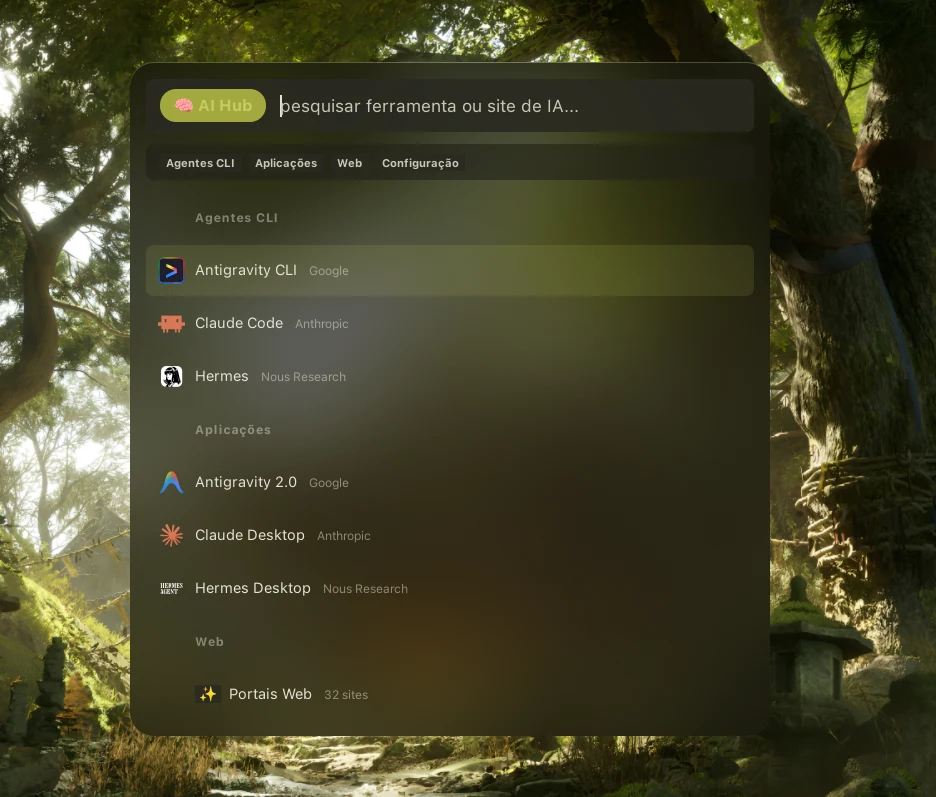

# Hypr.AI

[🇵🇹 Português](README.pt.md) · 🇬🇧 **English** · [🇪🇸 Español](README.es.md) · [🇨🇳 简体中文](README.zh.md)

<p align="center"></p>

**Native AI launcher for Hyprland** — CLI agents, desktop apps and curated web portals behind a single Rofi menu. Nothing is hard-coded: tools appear only if they are actually installed, and the whole window follows your wallpaper's Material You palette.

## Contents

[Features](#features) · [Detected tools](#detected-tools) · [Requirements](#requirements) · [Installation](#installation) · [Usage](#usage) · [Configuration](#configuration) · [Adding a tool or site](#adding-a-tool-or-site) · [Troubleshooting](#troubleshooting) · [Architecture](#architecture) · [Credits](#credits) · [Licence](#licence)

## Features

- **Runtime detection** — CLI agents and desktop apps are declared in `tools.conf` as *candidates*; the launcher probes each one every time it opens and shows only what exists. Install a tool and it appears on its own; uninstall it and it disappears. No editing required.
- **Detection runs inside `fish`**, not bare bash: Hyprland hands processes a minimal `PATH`, so a tool installed via linuxbrew/nvm/pyenv would be invisible even though it runs perfectly. Probing in the same shell that launches it keeps both in sync.
- **33 curated AI web portals** in `sites.conf`, grouped into chat, search, writing, dev, code and media — opening in your default browser.
- **Material You tonal colour**: the entire palette (backgrounds, text, containers — not just the accent) is pulled live from [Noctalia](https://github.com/noctalia-dev/noctalia-shell), with [Caelestia](https://github.com/caelestia-dots/shell) as a fallback. The menu looks like part of your desktop, not a widget borrowed from another theme.
- **Real glass**, not a flat translucent box: a top-only light rim, a content layer tonally lifted above the blurred backdrop, and an opacity tuned to the point where the compositor's blur actually reads (see [DESIGN.md](DESIGN.md)).
- **Real icons**: Rofi's native icon protocol with per-entry SVG/PNG, falling back to an emoji chip when no icon file exists.
- **Five languages** — pt-PT, pt-BR, es-ES, en-GB and 中文 — picked from the system locale.
- **Closed design system**: base grid with consistent spacing, concentric radii, one-word tab labels and an OKLCH palette with verified WCAG contrast. Every number is documented in [DESIGN.md](DESIGN.md).
- **Hyprland integration**: global `Super + I` shortcut, works under `uwsm` or plain Hyprland, and the installer offers to add the layer rule that lets the glass render at all.

## Detected tools

Everything below ships pre-configured as a candidate and stays invisible until you install it.

| Category | Tools |
|---|---|
| CLI agents | Claude Code · Antigravity CLI · Gemini CLI · Codex CLI · Aider · GitHub Copilot CLI · Cursor CLI · OpenCode · Goose · Ollama · Qwen Code · Crush · Mods · Plandex · Droid · OpenHands · Cline · Hermes |
| Desktop apps | Claude Desktop · Antigravity 2.0 · Cursor · Windsurf · Zed · LM Studio · Jan · GPT4All · AnythingLLM · Chatbox · Msty · Hermes Desktop |
| Web portals | 33 sites — Gemini, Claude, ChatGPT, DeepSeek, Grok, Kimi, Qwen, Mistral, Copilot, Perplexity, v0, Lovable, Midjourney, Suno, ElevenLabs, Runway and more |

Anything not on the list takes one line in `tools.conf` — see [Adding a tool or site](#adding-a-tool-or-site).

## Requirements

- Hyprland
- rofi (1.7+, for the icon protocol)
- bash, and **fish** — CLI agents open inside `kitty` running your interactive fish shell, which is also what makes detection see your real `PATH`
- **Recommended:** [Noctalia](https://github.com/noctalia-dev/noctalia-shell) or [Caelestia](https://github.com/caelestia-dots/shell) — without either, the menu falls back to a fixed dark violet palette
- Optional: libnotify (notifications), uwsm (session scoping)

## Installation

```bash
git clone https://github.com/mastermaiolo/hyprai && cd hyprai
./install.sh
```

The installer copies everything to `~/.config/hypr/hyprai/`, creates the `hyprai` executable in `~/.local/bin/`, registers the tonal bridge with Noctalia (if installed), adds the `Super + I` keybind to `binds.lua` (if the file exists, asking for another key if that combination is already taken), and **asks** before adding a glass layer rule to your `windowrules.lua`. It never touches your global blur settings.

> After installing, change wallpaper or accent in Noctalia once so it generates the colour bridge for the first time.

## Usage

- `Super + I` — open the menu
- `hyprai` — same thing, from a terminal
- Type to filter; `Enter` opens; `Esc` closes
- **Web portals** opens a submenu; `↩ Back` returns

## Configuration

Two declarative plain-text files, both editable from inside the menu:

| File | What it holds |
|---|---|
| `~/.config/hypr/hyprai/config/tools.conf` | CLI agents and desktop apps, with detection candidates |
| `~/.config/hypr/hyprai/config/sites.conf` | Curated web portals, grouped by category |

> `install.sh` deliberately **does not overwrite** these two files on reinstall — your curation survives updates. When changing them in the repository, copy them across by hand.

## Adding a tool or site

**A local tool** (`tools.conf`):

```conf
id | icon | Name | Subtext | category | candidates | svg | args
```

- `category` — `cli` (runs in a kitty terminal) or `desktop` (graphical app)
- `candidates` — one or more binaries/paths separated by `;`, probed in order; the first that exists wins and becomes the launch command. A bare name is looked up in `PATH`; an absolute path (or one starting with `~`) is tested directly
- `args` — optional fixed arguments, for when one binary serves both the CLI and the GUI:

```conf
hermes_cli|🪽|Hermes|Nous Research|cli|hermes|hermes.png|chat
hermes_desktop|🪽|Hermes Desktop|Nous Research|desktop|hermes|hermes-agent-text.svg|desktop
```

**A web portal** (`sites.conf`):

```conf
id | icon | Name | category | https://url | svg
```

Categories: `chat`, `search`, `write`, `dev`, `code`, `media`.

In both files the `svg` column names a file inside `svg/` (PNG works too) and falls back to the emoji in column two.

## Troubleshooting

**A tool I have installed doesn't show up.** The binary name in `candidates` probably doesn't match yours — check with `which <name>` and adjust the line. Detection fails silently by design: a wrong name just leaves the entry invisible.

**The menu looks opaque, with no glass.** Three causes, in order:
1. Missing layer rule — layer-shell surfaces get no blur in Hyprland unless a rule targets their namespace. Re-run `./install.sh` and accept the glass exception.
2. `xray = true` on that rule — re-run `./install.sh`, which now warns about it. xray tells the blur to skip intermediate layers and sample the background, but on desktops where the wallpaper *is* a layer (Noctalia's, for one), it skips the very thing it should blur: the sharp wallpaper shows straight through and the glass vanishes, silently. Desktop widgets sitting behind the menu go unblurred for the same reason.
3. Opacity too high — above ~85% the blur has no light left to contribute and the panel reads as flat paint. `bg0` ships at 70%.

**A screenshot shows glass but my screen doesn't.** They genuinely differ: `grim` captures before the compositor's blur pass, so those few percent of transparency show a *sharp* wallpaper (which reads as glass), while your display shows a *blurred* one (uniform, reads as paint). Trust your eyes, not the screenshot — when it's calibrated correctly, both agree.

**Colours don't follow my wallpaper.** Noctalia only re-renders the template on a wallpaper/scheme change. Force it with `noctalia msg config-reload && noctalia msg templates-apply`.

## Architecture

```
hyprai/
├── config/
│   ├── sites.conf        # Curated web portals
│   └── tools.conf        # CLI agents/desktop apps — probed at runtime
├── rofi/
│   └── hyprai.rasi       # Theme — grid, radii and palette
├── svg/                  # Per-entry icons (Rofi's icon protocol)
├── theme/
│   └── noctalia.rasi.tmpl # Template Noctalia renders into the tonal bridge
├── ui/
│   └── launcher.sh       # The launcher itself
├── install.sh
├── uninstall.sh
└── DESIGN.md             # Tokens and the reasoning behind each number
```

Rows are built as parallel arrays (text, id, icon) and handed to `rofi -dmenu -format i`, so the returned index maps back to an id without ever printing it on screen. The tonal bridge is a `.rasi` fragment Noctalia regenerates on every scheme change; `launcher.sh` passes it straight through with `-theme-str`, so colour changes need no restart.

## Credits

Built on the architecture, ergonomics and design conventions of [HyprVision](https://github.com/mastermaiolo/hyprvision).

Layout, spacing, palette and contrast follow the **coherent-design** system — see [DESIGN.md](DESIGN.md) for the tokens and the reasoning.

## Licence

MIT
